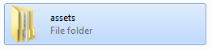
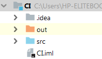
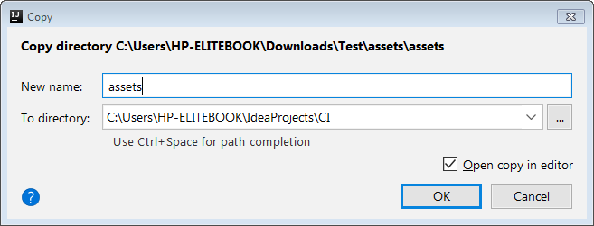
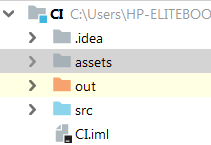

## TechKids - Code Intensive - Hướng dẫn thực hành
### Thêm assets cho game

1. Download assets, bao gồm hình ảnh và âm thanh cho game từ link sau: https://bit.ly/tk-ci-assets

2. Giải nén file `assets.zip` download được

3. Copy folder này bằng cách click chuột phải chọn Copy hoặc nhấn `Ctrl+C/Cmd+C`

4. Quay lại IntelliJ, click chọn project (mức cao nhất)

5. Rồi nhấn `Ctrl+V/Cmd+V` để paste toàn bộ folder `assests` vào project

6. Một dialog hiện lên thông báo và cho phép tùy chỉnh hành động copy

7. Nhấn OK

8. Nếu như folder `assets` được copy vào và đặt vào cùng bậc với thư mục `src`, việc copy đã hoàn thành

*Bài tiếp theo [Thêm hình nền](add_background.md)*

