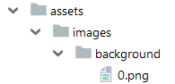
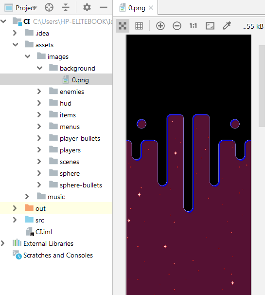
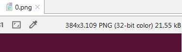
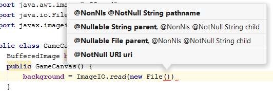
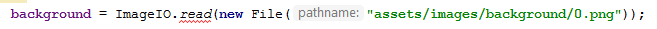
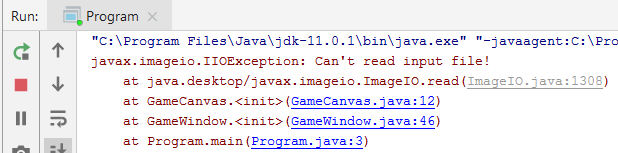
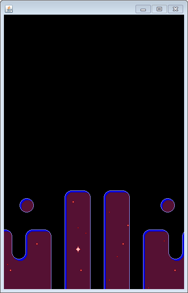

## TechKids - Code Intensive - Hướng dẫn thực hành
### Thêm hình nền

1. Trong IntelliJ, mở folder assets, images rồi đến background

2. Click đúp vào file `0.png`, sẽ thấy IntelliJ hiển thị hình này lên, đây chính là hình nền sử dụng cho game

3. Ngoài việc hiển thị ảnh, IntelliJ còn cho biết ảnh này có kích thước là bao nhiêu (theo pixcel) ở phía trên bên phải bức ảnh

4. Mở file `GameCanvas.java`

5. Khai báo thuộc tính (property) `background`, kiểu `BufferedImage` để sắp tới sẽ chứa nội dung của ảnh nền

<pre>
import java.awt.image.BufferedImage;

public class GameCanvas extends JPanel {
    BufferedImage background;
    ...
}
</pre>

6. Khai báo hàm tạo của `GameCanvas`

<pre>
public class GameCanvas extends JPanel {
    BufferedImage background;
    <b>public GameCanvas() {
        
    }</b>
    ...
}
</pre>

7. Thực hiện load file hình nền `0.png` trong hàm tạo `GameCanvas` sử dụng hàm `read()` của thư viện `ImageIO`. 

<pre>
...
<b>import javax.imageio.ImageIO;</b>

public class GameCanvas extends JPanel {
    BufferedImage background;
    public GameCanvas() {
        <b>background = ImageIO.read()</b>
        ...
    }
}
</pre>

Chú ý: Cần để thao tác load file trong hàm tạo, để khi một `GameCanvas` được tạo ra, file hình nền sẽ tự động được load

8. Khi viết đến `read()`, IntelliJ sẽ gợi ý như sau

9. Hàm `ImageIO.read()` đang yêu cầu dữ liệu đầu vào để có thể chuyển thành ảnh, ở đây, chọn `File` làm nguồn dữ liệu đầu vào bằng cách thêm `new File()` vào bên trong hàm `read()`, IntellJ tiếp tục gợi ý như sau

10. Hàm `new File()` đang yêu cầu vị trí của file cần đọc, cung cấp cho hàm này một string chứa đường dẫn của file `0.png`, tính từ folder cao nhất đi vào như sau

<pre>
public GameCanvas() {
    background = ImageIO.read(new File(<b>"assets/images/background/0.png"</b>));
    ...
}
</pre>

11. Viết đến đây, Java sẽ báo lỗi ở hàm `read()` như sau

12. Lỗi báo như trên được gọi là `Exception`, thường sẽ được sinh ra khi có phát sinh lỗi ngoài ý muốn, thông thường không kiểm soát được bởi người lập trình. Ví dụ trong trường hợp này chính là việc đường dẫn tới background `0.png` tại thời điểm load có thực sự tồn tại hay không (bị xóa mất hay bị chuyển đi folder khác).

13. Cách thường được chọn để giải quyết trong các tình huống này là bọc phần code có khả năng sinh `Exception` bằng khối `try-catch`, bằng cách chọn vào chỗ đang được báo lỗi là hàm `read()` rồi nhấn `Atl+Enter`, chọn "Surround with try/catch" rồi nhấn `Enter`

14. IntelliJ sẽ sinh ra khối `try-catch` để bọc lại đoạn code có `Exception` như sau

<pre>
<b>try {</b>
    background = ImageIO.read(new File("assets/images/background/0.png"));
<b>} catch (IOException e) {
    e.printStackTrace();
}</b>
</pre>

15. Ý tưởng của `try-catch` là sẽ để chương trình <b>thử</b> (`try`) thực hiện một đoạn lệnh nào đó, nếu đoạn lệnh này có xảy ra lỗi (`Exception`) thì thay vì chương trình dừng lại thì sẽ thực hiện lệnh trong khối `catch` và sau đó vẫn chạy tiếp bình thường.

16. Nếu việc load ảnh thành công, khối lệnh trong `catch` sẽ không được thực hiện. Có thể mô phỏng tình huống lỗi bằng cách làm cho đường dẫn tới file hình nền `0.png` bị sai lệch

<pre>
background = ImageIO.read(new File("assets/images/background/<b>99999</b>.png"));
</pre>

17. Khi thử chạy chương trình, sẽ thấy có xuất hiện thông báo lỗi ở cửa sổ `Run`, trong khi `GameWindow` vẫn có thể sử dụng được mà không hề bị gián đoạn

18. Điều chỉnh lại đường dẫn tới file hình nền cho đúng

<pre>
background = ImageIO.read(new File("assets/images/background/<b>0</b>.png"));
</pre>

19. Thực hiện vẽ hình nền bằng cách viết thêm vào hàm `paintComponent`, sử dụng hàm `g.drawImage()` với các tham số lần lượt là **ảnh nền**, **tọa độ theo trục x**, **tọa độ theo trục y** và `ImageObserver`. Vì `ImageObserver` sẽ không được dùng đến và luôn để bằng `null` trong suốt quá trình thực hiện game nên sẽ không được trình bày trong tài liệu này

<pre>
protected void paintComponent(Graphics g) {
  g.fillRect(0, 0, 800, 600);
  <b>g.drawImage(background, 0, 0, null);</b>
}
</pre>

Chú ý: Thứ tự thực hiện các lệnh trong `paintComponent` rất quan trọng, cụ thể thao tác nào được viết trước sẽ được thực hiện trước, thao tác nào được viết sau sẽ được thực hiện sau. Do vậy trong trường hợp này, để hình nền có thể hiện lên mà không bị lớp màu đen đè mất thì `g.drawImage()` phải được gọi sau `g.fillRect()`

20. Chạy chương trình

21. Nếu `GameWindow` hiện ra với background được vẽ lên, mục tiêu của bài đã hoàn thành

