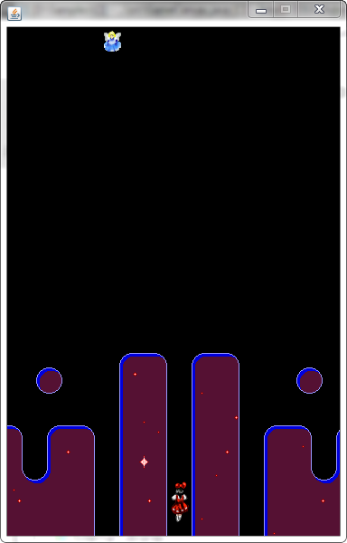
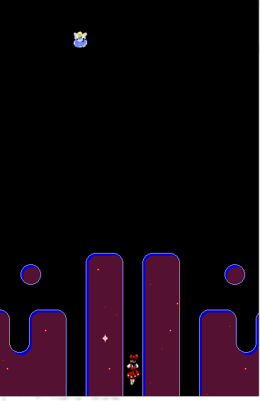

## TechKids - Code Intensive - Hướng dẫn thực hành
### Thêm quân địch

1. Mở file `GameCanavs.java`, thêm thuộc tính `enemy` kiểu `BufferedImage`

<pre>
public class GameCanvas extends JPanel {
    BufferedImage background;
    BufferedImage player;
    <b>BufferedImage enemy;</b>
    ...
</pre>

2. Trong hàm `GameCanvas()` thực hiện load ảnh

<pre>
public GameCanvas() {
    try {
        background = ImageIO.read(new File("assets/images/background/0.png"));
        player = ImageIO.read(new File("assets/images/players/straight/0.png"));
        <b>enemy = ImageIO.read(new File("assets/images/enemies/level0/blue/0.png"));</b>
    }
    ...
}
</pre>

3. Khai báo hai thuộc tính `enemyX`, `enemyY` dùng để điều khiển vị trí của quẩn địch

<pre>
int playerX = 176;
int playerY = 500;
<b>int enemyX = 100;
int enemyY = 0;</b>

public GameCanvas() {
    ...
</pre>

4. Thực hiện hiển thị quân địch trong hàm `paintComponent()`

<pre>
@Override
protected void paintComponent(Graphics g) {
    ...
    g.drawImage(player, playerX, playerY, null);
    <b>g.drawImage(enemy, enemyX, enemyY, null);</b>
}
</pre>

5. Chạy chương trình

6. Quân địch đã được hiển thị tuy nhiên vẫn chưa di chuyển

7. Thêm hàm `updateEnemyPosition()` vào `gameLoop()` để cập nhật vị trí của quân địch trong mỗi chu kỳ game

<pre>
public void gameLoop() {
    while(true) {
        updatePlayerPosition();
        <b>updateEnemyPosition();</b>
        repaint();
        ...
    }
}
</pre>

Chú ý: hàm `updateEnemyPosition()` chưa tồn tại, sẽ được khai báo và thực hiện sau

8. Trong class `GameCanvas`, Khai báo phương thức `updateEnemyPosition()`

<pre>
<b>void updateEnemyPosition() {
    
}</b>

void updatePlayerPosition() {
    ...
}
</pre>

9. Thực hiện cập nhật tọa độ của quân địch trong hàm `updateEnemyPosition()`. Do quân địch di chuyển tự dộng, việc cập nhật tọa độ được thực hiện mà không cần điều kiện từ bán phím

<pre>
void updateEnemyPosition() {
    enemyY += 1;
}
</pre>

10. Chạy chương trình

11. Kết quả là quân địch đã có thể di chuyển từ trên xuống dưới

