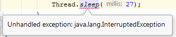

## TechKids - Code Intensive - Hướng dẫn thực hành
### Thêm vòng lặp game

1. Thêm phương thức `gameLoop()` vào `GameCanvas`
<pre>
@Override
    protected void paintComponent(Graphics g) {
        ...
    }

    <b>public void gameLoop() {
        
    }
    </b>
</pre>

2. Trong `gameLoop()` này, viết thêm một vòng lặp vô hạn

<pre>
public void gameLoop() {
    <b>while(true) {

    }</b>
}
</pre>

3. Mỗi khi vòng lặp này chạy, thực hiện `repaint`

<pre>
public void gameLoop() {
    <b>while(true) {
        <b>repaint ();</b>
    }</b>
}
</pre>

4. Để cho việc `repaint()` được thực hiện với tần suất 60 lần trong 1 giây (60fps) bằng cách sau khi `repaint()` được gọi, thực hiện chờ 1 khoảng thời gian là `1/60 = 0.0167 ~ 0.017 = 17ms`

<pre>
public void gameLoop() {
    while(true) {
        repaint();
        <b>Thread.sleep(17);</b>
    }
}
</pre>

5. Sẽ xuất hiện lỗi vì `Thread.sleep()` là hàm có `Exception`:

6. Bọc `try-catch` vào đoạn code có `Exception` này bằng việc chọn hàm `sleep` và gõ `Alt+Enter` rồi chọn `try-catch`

<pre>
...
<b>try {</b>
    Thread.sleep(17);
<b>} catch (InterruptedException e) {
    e.printStackTrace();
}</b>
</pre>

7. Xóa `repaint()` ở trong hàm `paintComponent()` đi. Từ nay, mỗi khi cập nhật lại game, không cần gọi thêm hàm `repaint()`, vì hàm này đã được gọi liên tục ở trong `gameLoop()`

<pre>
public void keyPressed(KeyEvent e) {
    ...

    <s>repaint();</s>
}
</pre>

8. Chạy crhương trình

9. Sẽ thấy nhân vật không được vẽ lại sau khi đã bấm nút (i.e. Không nhìn thấy nhân vật di chuyển), c uyên nhân là do hàm gameLoop() mặc dù đã được viết ra nhưng chưa được mang ra sử dụng

10. Mở file `GameWindow()`, khởi động vòng lặp game bằng cách gọi `gc.gameLoop()` ở cuối cùng của hàm `GameWindow()`

<pre>
public class GameWindow extends JFrame {
    GameCanvas gc;
    public GameWindow() {
        ...
        setContentPane(gc);
        setVisible(true);
        <b>gc.gameLoop();</b>
    }
}
</pre>

11. Chạy chương trình

12. Kết quả là nhân vật đã được vẽ lại khi di chuyển, vòng lặp game đã hoạt động
