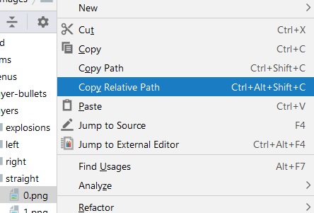
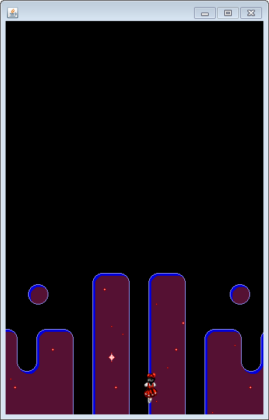
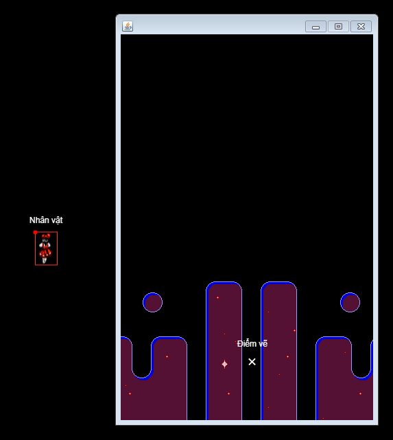
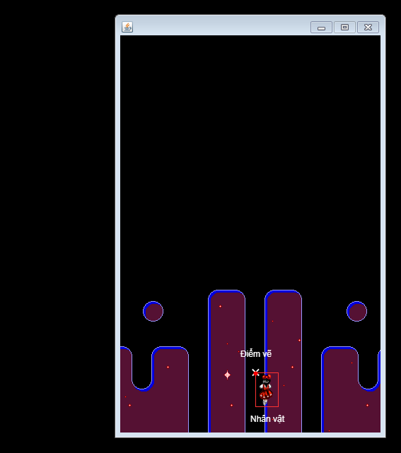

## TechKids - Code Intensive - Hướng dẫn thực hành
### Thêm nhân vật chính

1. Khai báo một thuộc tính kiểu `BufferedImage` tên là `player` trong `GameCanvas`

<pre>
public class GameCanvas extends JPanel {
    BufferedImage background;
    <b>BufferedImage player;</b>
    ...
}
</pre>

2. Thực hiện load file ảnh player đã cho vào `player`

<pre>
try {
    background = ImageIO.read(new File("assets/images/background/0.png"));
    <b>player = ImageIO.read(new File("assets/images/players/straight/0.png"));</b>
  } catch (IOException e) {
    e.printStackTrace();
}
</pre>

Chú ý:

* Để lấy nhanh đường dẫn đến file ảnh như trên, có thể chuột phải vào file cần load, click vào relative path và paste (`Ctrl+V`) vào nơi cần đường dẫn này

* Vì `Exception` của việc load background và việc load player là gióng nhau (`IOException`) nên có thể dùng chung khối `try-catch`

3. Thực hiện vẽ `player` vừa trong hàm `paintComponent`. Vị trí (x, y) của player được tạm tính là `x = 384 / 2 = 192` và `y` vào khoảng `500`

<pre>
protected void paintComponent(Graphics g) {
    g.fillRect(0, 0, 384, 600);
    g.drawImage(background, 0, 0, null);
    <b>g.drawImage(player, 192,  500, null);</b>
}
</pre>

Chú ý: Cũng giống với `background` phải được vẽ sau khi đổ màu đen cho `GameCavas`, `player` phải được vẽ sau `background` nếu không muốn bị `background` che lên mất

4. Chạy chương trinh

5. Kết quả nhận được là `player` có hiện lên tuy nhiên hơi bị lệch sang phải

6. Lý do cho việc `player` bị lệch sang phải như trên, tất nhiên, là do tọa độ x tính toán không được chính xác

7. Một cách chi tiết hơn, trong `Swing` cũng như rất nhiều các thư viện khác, khi một hình được vẽ lên trên một bề mặt, thì mặc định, hình sẽ được đặt vào sao cho góc trái của hình trùng với điểm vẽ. Minh họa như sau

Khi vẽ `player` lên, sẽ thành

