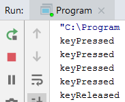
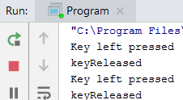
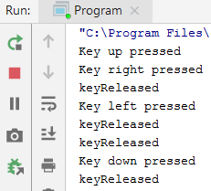
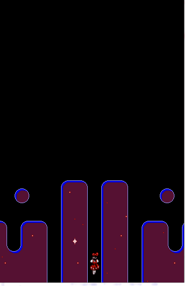

## TechKids - Code Intensive - Hướng dẫn thực hành
### Thêm di chuyển cho nhân vật

1. Mở file `GameCanvas.java`

2. Thực hiện bắt sự kiện phím bấm của người chơi bằng cách gọi hàm `setFocusable()` để cho phép `GameCanvas` có thể nhận được phím bấm từ người dùng

<pre>
public GameCanvas() {
    ...

    <b>setFocusable(true);</b>
}
</pre>

Chú ý: Trong giao diện người dùng, `focusable=true` đống nghĩa với việc phần giao diện này có thể nhận được các tác động từ người dùng như nhấn phím hay click chuột

3. Và gọi hàm `addKeyListener()`

<pre>
public GameCanvas() {
    ...

    setFocusable(true);
    <b>addKeyListener()</b>
}
</pre>

4. Hàm này sẽ yêu cầu một tham số, có kiểu là `KeyListener`

5. Cung cấp tham só này cho hàm `addKeyListener()` bằng cách khởi tạo một KeyListener làm tham số đầu vào

<pre>
public GameCanvas() {
    ...

    setFocusable(true);
    <b>addKeyListener(<b>new KeyListener</b>)</b>
}
</pre>

6. `KeyListener`, cũng giống như `WindowListener`, được sinh ra để giúp người lập trình thêm vào các thao tác xử lý của mình với các sự kiện rồi được cài vào nơi sẽ xảy ra sự kiện là `GameCanvas` thông qua hàm `addKeyListener()`

7. Khi được `IntelliJ` gợi ý hoành thành nốt, chọn vào `new KeyListener()` rồi nhấn `ENTER` để `IntellIJ` hoàn thành toàn bộ khai báo của tham số này

8. Kết quả sau khi `IntelliJ` sinh code

<pre>
addKeyListener(new KeyListener() <b>{
    @Override
    public void keyTyped(KeyEvent e) {

    }

    @Override
    public void keyPressed(KeyEvent e) {

    }

    @Override
    public void keyReleased(KeyEvent e) {

    }
}</b>);
</pre>

9. Trong các hàm được cung cấp, có `keyPressed()` và `keyReleased()` sẽ được quan tâm

<pre>
addKeyListener(new KeyListener() {
    @Override
    public void keyTyped(KeyEvent e) {

    }

    @Override
    public void keyPressed(KeyEvent e) {
      <b>System.out.println("keyPressed");</b>
    }

    @Override
    public void keyReleased(KeyEvent e) {
      <b>System.out.println("keyReleased");</b>
    }
});
</pre>

10. Để kiểm tra khi nào thì hàm nào được gọi, thực hiện log (in ra cửa sổ run) vào trong mỗi hàm với nội dung là chính tên hàm

11. Chạy chương trình

12. Thực hiện nhấn các phím, đặc biệt là các phím sẽ được sử dụng là các phím mũi tên lên &uarr;, xuống &darr;, trái &larr;, phải &rarr;

13. Sau khi nhấn thử vài phím, có các quan sát như sau:
* Khi một phím được nhấn xuống, `keyPressed()` sẽ được gọi
* Khi nhả phím đó ra (không nhấn nữa), `keyReleased()` sẽ được gọi
* Với một lần thử, tính từ lúc nhấn phím cho đến lúc nhả phím, có thể `keyPressed()` được gọi nhiều lần nhưng `keyReleased()` chỉ được gọi một lần duy nhất

14. Ngoài việc biết được khi nào người dùng nhấn nút, cần phải biết nút được nhấn là nút nào để điều khiển nhân vật tương ứng. Thông tin này có thể lấy được nhờ vào tham số `KeyEvent e` truyền vào hai hàm trên

Chú ý: Với mỗi một sự kiện xảy ra, đôi khi biết được sự kiện này xảy ra lúc nào là chưa đủ, người lập trình sẽ cần quan tâm thêm các thông tin khác của sự kiện này, ví dụ nếu người dùng click chuột thì ngoài việc biết được khi nào click có thể sẽ quan tâm xem đó là chuột trái, phải hay giữa, vị trí click vào, tất cả những tham số như vậy, thường sẽ được mô tả cung cấp qua tham số `e`, có kiểu `Event`, truyền vào hàm tương úng với sự kiện

15. Xử lý `keyPressed()` trước

16. Kiểm tra mã phím (`keyCode`) bằng hàm `e.getKeyCode()` để xác định phím nào được nhấn trong mỗi lần `keyPressed()` được gọi. Trước mắt kiểm tra với phím mũi tên sang trái &larr;

<pre>
@Override
  public void keyPressed(KeyEvent e) {
    <b>if(e.getKeyCode() == KeyEvent.VK_LEFT) {
      System.out.println("Key left pressed");
    }</b>
  }
</pre>

Chú ý: Để phân biệt, mỗi phím trên bàn phím được đánh một con số, thường là không đổi qua các ngôn ngữ và thư viện khác nhau. Check ỏ đây: https://docs.oracle.com/javase/7/docs/api/constant-values.html

17. Chạy chương trình, kiểm tra bằng cách thử nhấn các phím, bao gồm phím mũi tên sang trái và một vài phím khác

18.  Kết quả là chỉ khi phím mũi tên sang trái được nhấn, dòng `Key left pressed` mới được in ra

19. Thực hiện việc kiểm tra phím với 3 phím mũi trên sang phái &rarr; mũi tên lên &uarr; mũi tên xuống &darr;

<pre>
@Override
public void keyPressed(KeyEvent e) {
    if(e.getKeyCode() == KeyEvent.VK_LEFT) {
        System.out.println("Key left pressed");
    } <b>else if (e.getKeyCode() == KeyEvent.VK_RIGHT) {
        System.out.println("Key right pressed");
    } else if (e.getKeyCode() == KeyEvent.VK_UP) {
        System.out.println("Key up pressed");
    } else if(e.getKeyCode() == KeyEvent.VK_DOWN) {
        System.out.println("Key down pressed");
    } </b>
}
</pre>

20. Chạy thử và kiểm tra xem chương trình đã có thể phân biệt đủ 4 phím này hay chưa

21. Sau khi bắt được các phím cần thiết trong `keyPressed()`, cần xử lý di chuyển nhân vật tương ứng với các phím

22. Để di chuyển được, cần chuyển vị trí của player trong hàm `paintComponent()` từ số cố định thành thuộc tính có thể thay đổi được

<pre>
<b>int playerX = 176;
int playerY = 500;</b>

@Override
protected void paintComponent(Graphics g) {
    super.paintComponent(g);
    g.fillRect(0, 0, 384, 600);
    g.drawImage(background, 0, 0, null);
    <b>g.drawImage(player, playerX, playerY, null);</b>
}
</pre>

23. Chạy thử để kiểm tra xem việc chuyển đổi từ số cố định thành thuộc tính có bị lỗi hay không

24. Thực hiện thay đổi vị trí của nhân vật khi người dùng nhấn các phím bằng cách thay dổi hai thuộc tính vừa thêm vào ở trong các trường hợp tương ứng

<pre>
if(e.getKeyCode() == KeyEvent.VK_LEFT) {
    <b>playerX -= 5;</b>
} else if (e.getKeyCode() == KeyEvent.VK_RIGHT) {
    <b>playerX += 5;</b>
} else if (e.getKeyCode() == KeyEvent.VK_UP) {
    <b>playerY -= 5;</b>
} else if(e.getKeyCode() == KeyEvent.VK_DOWN) {
    </b>playerY += 5;</b>
}
</pre>

25. Chạy chương trình và thử nhấn các phím

26. Kết quả là nhân vật chính không di chuyển theo phím bấm như kỳ vọng.

27. Lý do cho kết quả này không phải là do phần code vừa thêm ở `onKeyPressed()` không được chạy hay cách cập nhật tọa độ nhân vật chưa đúng mà hàm `paintComponent()` không được chạy lại mặc dù tọa độ đã được cập nhật, cần kích hoạt việc chạy lại `paintComponent()` bằng cách gọi hàm `repaint()` của `GameCanvas` hay `JFrame`

<pre>
public void keyPressed(KeyEvent e) {
    ...
    <b>repaint();</b>
}
</pre>

28. Chạy lại chương trình và nhấn thử các phím

29. Kết quả là nhân vật đã đi chuyển khi bấm phím

30. Nếu để ý kỹ sẽ thấy rằng di chuyển của nhân vật có phần hơi lag giật chứ không được liên tục, mượt mà khi bấm phím, vấn đề này có thể khắc phục được, tuy nhiên sẽ được hướng dẫn ở các bài sau