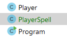
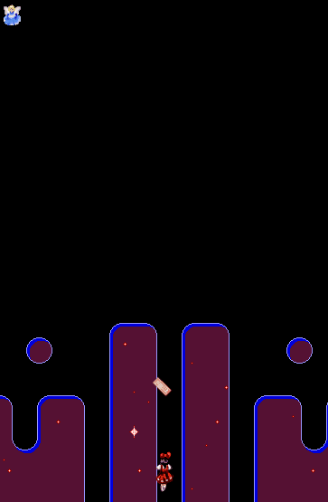

## TechKids - Code Intensive - Hướng dẫn thực hành
### Thêm bùa cho nhân vật

1. Tạo file `PlayerSpell.java`

2. Khai báo các methods phục vụ cho chức năng cần có

<pre>
<b>
import java.awt.*;</b>

public class PlayerSpell {
    <b>
    // Load ảnh
    void loadImage() {

    }

    // Vẽ, hiển thị hình ảnh
    void paint(Graphics g) {

    }

    // Di chuyển
    void move() {

    }</b>
}

</pre>

3. Khai báo các properties cần thiết để thực hiện các chức năng trên

<pre>
import java.awt.*;
<b>import java.awt.image.BufferedImage;</b>

public class PlayerSpell {
<b>    int x;
    int y;
    BufferedImage image;</b>

    void loadImage() {
    ...
}
</pre>

4. Thực hiện chức năng load ảnh

<pre>
    void loadImage() {
        <b>try {
            image = ImageIO.read(new File("assets/images/player-spells/a/0.png"));
        } catch (IOException e) {
            e.printStackTrace();
        }</b>
    }
</pre>

5. Thực hiện chức năng vẽ ảnh
<pre>
    void paint(Graphics g) {
        <b>g.drawImage(image, x, y, null);</b>
    }
</pre>

6. Thực hiện chức năng di chuyển (bay lên trên).
<pre>
    void move() {
        <b>y -= 10;</b>
    }
</pre>

4. Đưa `PlayerSpell` vào sử dụng trong `GameCanvas`, bắt đầu bằng việc khai báo biến / đối tượng
<pre>
public class GameCanvas extends JPanel {
    ...
    Enemy e;
    <b>PlayerSpell ps;</b>

    boolean leftPressed;
    ...
</pre>

5. Khởi tạo và load ảnh

<pre>
    public GameCanvas() {
        e = new Enemy();
        p = new Player();
        <b>ps = new PlayerSpell();</b>
        try {
            background = ImageIO.read(new File("assets/images/background/0.png"));
            <b>ps.loadImage();</b>
            p.loadImage();
            ...
</pre>

6. Đặt vị trí xuất hiện của viên đạn ở phía trên đầu `Player`
<pre>
    public GameCanvas() {
        p = new Player();
        
        ps = new PlayerSpell();
        <b>ps.x = 170;
        ps.y = 450;</b>
        try {
    ...
</pre>

7. Hiển thị hình ảnh

<pre>
    @Override
    protected void paintComponent(Graphics g) {
        ...
        e.paint(g);
        <b>ps.paint(g);</b>
    }
</pre>

8. Di chuyển

<pre>
    void updatePlayerPosition() {
        p.move(leftPressed, rightPressed, upPressed, downPressed);
    }

    <b>void updatePlayerSpellPosition() {
        ps.move();
    }</b>

    public void gameLoop() {
        while (true) {
            updatePlayerPosition();
            updateEnemyPosition();
            <b>updatePlayerSpellPosition();</b>
            repaint();
            ...
        }
    }
</pre>

9. Chạy thử và quan sát kết quả

10. Kết quả trên chưa đạt được yêu cầu thực tế, là có nhiều lá bùa, xuất hiện tại những thời điểm khác nhau với vị trí nắm ngay bên trên vị trí của Player tại thời điểm xuất hiện và đặc biệt là di chuyển độc lập với nhau. Những yêu cầu còn thiếu này sẽ được giải quyết ở các bài sau.