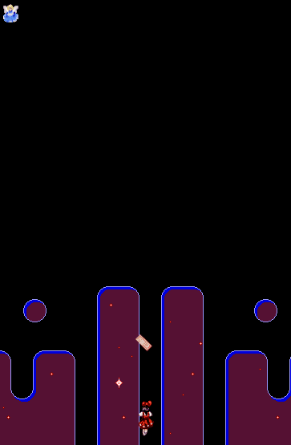

## TechKids - Code Intensive - Hướng dẫn thực hành
### Thêm nhiều bùa cho nhân vật

1. Ở bài trước, một lá bùa - `PlayerSpell` đã được thêm vào `GameCanvas`, ở bài này, nhiều lá bùa sẽ được thêm vào và xuất hiện cùng lúc.

2. Việc cần làm với yêu cầu này, trong khả thi, không phải là khai báo thêm biến kiểu `PlayerSpell` trfwong `GameCanvas`. Lý do không được làm việc này là vì số lượng Spell trong tương lai sẽ xuất hiện nhiều, trên thực tế là mỗi khi người dùng nhấn phím X để bắn, mỗi lần như vậy, không thể tạm dừng chương trình lại, thêm một biến `PlayerSpell`, chạy lại chương trình rồi mời người chơi chơi tiếp được

3. Tất cả các đối tượng `PlayerSpell` cần phải được quản lý bằng 1 biến duy nhất, để mỗi khi một `PlayerSpell` mới cần được sinh ra, chương trình không cần thay đổi gì

4. Việc quản lý tất cả `PlayerSpell` cần một kiểu dữ liệu có thể chứa được các phần tử giống nhau về kiểu, có thể thêm hay xóa các phần tử ở thời điểm chương trình đã chạy (run-time). Kiểu dữ liệu đáp ứng được các yếu tố này, được gọi là `List` (danh sách), trong `Java`, lập trình viên có thể lựa chọn các biến thể khác nhau của `List`: `ArrayList`, `Vector`, `LinkedList`. Các kiểu dữ liệu này, nếu chỉ thao tác với số lượng phần tử vừa phải (dưới 100, 200 phần tử), thì không khác biệt quá nhiều (Có thể đọc thêm về sự khác biệt giữa các kiểu dữ liệu này ở phụ lục). Ở trường hợp này, `ArrayList` sẽ được sử dụng.

5. Bắt tay vào thực hiện, thay khai báo của 1 đối tượng `PlayerSpell` thành 1 `ArrayList`
<pre>
  ...
  Enemy e;
  <s>PlayerSpell ps;</s>
  <b>ArrayList&lt;PlayerSpell&gt; spells;</b>

  boolean leftPressed;
  ...
</pre>

6. Thay thế code cho chức năng khởi tạo

<pre>
  <s>ps = new PlayerSpell();</s>
  <s>ps.x = 170;</s>
  <s>ps.y = 450;</s>
  <b>spells = new ArrayList<>();</b>
  try {
      background = ImageIO.read(new File("assets/images/background/0.png"));
      <s>ps.loadImage();</s>
      p.loadImage();
      ...
</pre>

7. Tạo trước 1 lá bùa và đưa vào `List`

<pre>
  spells = new ArrayList<>();
  <b>PlayerSpell firstSpell = new PlayerSpell();
  firstSpell.x = 170;
  firstSpell.y = 450;
  firstSpell.loadImage();
  spells.add(firstSpell);</b>
  try {
    ...
</pre>

8. Chức năng hiển thị hình ảnh

<pre>
  @Override
  protected void paintComponent(Graphics g) {
    ...
    <s>ps.paint(g);</s>
    <b>for (PlayerSpell ps: spells) {
        ps.paint(g);
    }</b>
  }
</pre>

9. Chức năng di chuyển

<pre>
    void updatePlayerSpellPosition() {
      <s>ps.move();</s>
      <b>for (PlayerSpell ps: spells) {
        ps.move();
      }</b>
    }
</pre>

10. Chạy thử chương trình

11. Có thấy việc sử dụng `List` ít nhất đã cho kết quả giống như việc sử dụng một biến / hay object `PlayerSpell`. Việc tiếp theo cần làm là sử dụng List này để thực hiện chức năng bắn bùa - mỗi khi người dùng nhấn `X`

12. Thêm trạng thái bấm phím `X`, `xPressed`

<pre>
  boolean downPressed;
  <b>boolean xPressed;</b>

  public GameCanvas() {
    ...
</pre>

13. Cập nhật trạng thái `xPressed` mỗi khi người dùng bấm hoặc nhả phím `X`

<pre>
  public GameCanvas() {
    ...
    addKeyListener(new KeyListener() {
      ...
      @Override
      public void keyPressed(KeyEvent e) {
        ...
        else if (e.getKeyCode() == KeyEvent.VK_DOWN) {
          downPressed = true;
        } <b>else if (e.getKeyCode() == KeyEvent.VK_X) {
          xPressed = true;
        }</b>
      }

      @Override
      public void keyReleased(KeyEvent e) {
        ...
        else if (e.getKeyCode() == KeyEvent.VK_DOWN) {
          downPressed = false;
        } <b>else if (e.getKeyCode() == KeyEvent.VK_X) {
          xPressed = false;
        }</b>
      }
    }
  }
</pre>

<pre>
public void gameLoop() {
  while (true) {
    <b>System.out.println(xPressed);</b>
    updatePlayerPosition();
    ...
  }
}
</pre>

14. Chạy thử và bấm, nhả phím `X` để kiểm tra, nếu giá trị của xPressed phản ánh đúng trạng thải của phím `X`, cụ thể `true` khi X được bấm và `false` khi không bấm, việc bắt trạng thái của `X` đã thành công

15. Bắt đầu thực hiện bắn đạn mỗi khi người dùng nhấn `X`, tạo hàm castSpells() và gọi hàm này trong gameLoop()

<pre>
    <b>void castSpells() {
        
    }</b>

    public void gameLoop() {
      while (true) {
        <s>System.out.println(xPressed);</s>
        <b>castSpells();</b>
        updatePlayerPosition();
</pre>

16. Trong thân hàm `castSpells()`, mỗi khi `xPressed=true` (người dùng nhấn `X`), tạo ra một viên đạn mới tại vị trí của Player và thêm vào List

<pre>
void castSpells() {
  <b>if (xPressed) {
    PlayerSpell newSpell = new PlayerSpell();
    newSpell.x = p.x;
    newSpell.y = p.y;
    newSpell.loadImage();
    spells.add(newSpell);
  }</b>
}
</pre>

17. Chạy thử và quan sát kết quả

18. Có thể thấy yêu cầu bắn ra nhiều lá bùa đã được đáp ứng, tuy nhiên tồn tại một số vấn đề sau

- Các lá bùa được bắn ra với tốc độ rất mau, gần như liên tục, sẽ gây ảnh hưởng tới cân bằng game
- Các lá bùa sau khi bay lên khỏi màn hình, nếu chờ đủ lâu, sẽ bắt đầu xuất hiện ở dưới đáy màn hình và bay lên
- Xuất hiện lỗi `ConcurrentModificationException` tại vòng `for` duyệt `spells` trong `paintComponent`

19. Bài này sẽ phân tích giải quyết vấn đề thứ 3 trước, hai vấn đề còn lại sẽ được giải quyết ở các bài sau

20. `ConcurrentModificationException` xảy ra khi xảy ra hành động thêm hoặc xóa phần từ trong một List đang được duyệt chưa xong. Khi số lượng phần tử lúc bắt đầu duyệt và lúc đang duyệt `List` là khác nhau, `ConcurrentModificationException` sẽ được sinh ra để báo động.

21. Có 2 kịch bản thường gây ra nên lỗi này

- Thực hiện thêm, xóa các phần tử trong chính thân vòng lặp của List

<pre>
  for (PlayerSpell ps: spells) {
    ps.paint(g);
    <b>spells.add(new Spell())</b>
    /* hoặc */
    <b>spells.remove(0)</b>
  }
</pre>

- Thực hiện thêm, xóa các phần từ ở ngoài vòng lặp list tuy nhiên phần code để thêm, xóa và vòng lặp chạy song song (chính xác là ở 2 thread khác nhau), đây chính là tình huống hiện tại: Hàm `paintComponent()`, do cần đảm bảo tính liên tục về giao diện (không lag, giật, chờ đợi các thao tác khác) nên đã được sắp xếp để ở 1 thread riêng, hiểu đơn giản là chạy song song với các hàm còn lại, bao gồm cả `gameLoop()`. Điều này dẫn đến tồn tại xác suất một lá bùa mới được thêm vào `spells` bởi `castSpells()` trong `gameLoop()` trong khi `paintComponent()` đang chạy dở phần code duyệt `spells`, đẫn đến lỗi.

22. Để giải quyết nguyên nhân trên, cần thay đổi cách duyệt `spells`, sử dụng từ khóa `synchronized` để đảm bảo các thao tác hoặc xóa phần tử phải chờ đến khi việc duyệt `spells` kết thúc mới có thể thực hiện

<pre>
  void castSpells() {
    if (xPressed) {
      ...
      <b>synchronized (spells) {</b>
          spells.add(newSpell);
      <b>}</b>
    }
  }
</pre>

<pre>
  @Override
  protected void paintComponent(Graphics g) {
    ...
    <b>synchronized (spells) {</b>
      for(PlayerSpell ps: spells) {
        ps.paint(g);
      }
    <b>}</b>
  }
</pre>

Chú ý: Có ý kiến cho rằng có thể giải quyết vấn đề này bằng cách dùng vòng lặp fori

<pre>
for(int i = 0; i < spells.size(); i++) {
  spells[i].paint(g);
}
</pre>

Tuy nhiên cách này không được khuyến cáo vì nó chỉ giải quyết vấn đề Exception không được hiện ra nhưng không giải quyết được việc sai khác về số lượng phần tử của spells trong lúc duyệt
