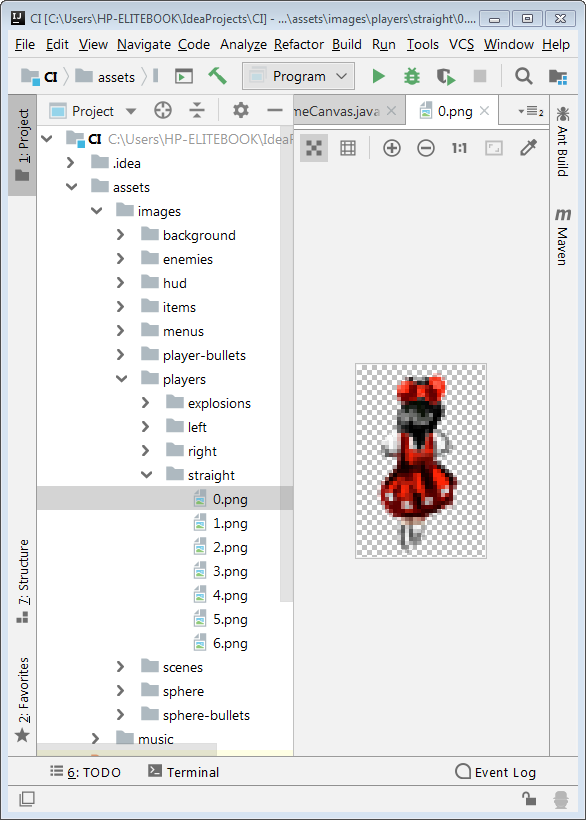

## TechKids - Code Intensive - Hướng dẫn thực hành
### Bài tập - thêm nhân vật chính

Thực hiện các bước giống như bài [Thêm ảnh nền](add_background.md) để thêm nhân vật chính vào cửa sổ game, với vị trí file ảnh

và vị trí nhân vật sau khi thêm vào cửa sổ game như sau

*Đáp án: [Thêm nhân vật](add_player.md)*