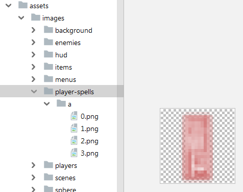

## TechKids - Code Intensive - Hướng dẫn thực hành
### Bài tập: Thêm tấn công cho nhân vật

1. Trong game, nhân vật tấn công bằng cách bắn những lá bùa để tiêu diệt kẻ địch, ảnh của những lá bùa được đặt ở vị trí như sau

2. Thực hiện phiên bản đầu tiên của tấn công cho nhân vật bằng cách sinh các lá bùa trên đỉnh đầu của nhân vật và bay thẳng lên phía trên