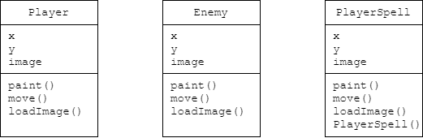
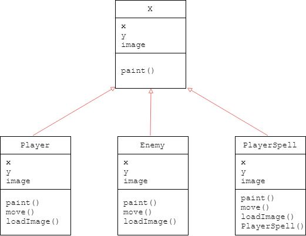
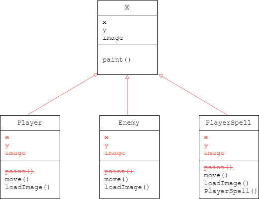

## TechKids - Code Intensive - Hướng dẫn thực hành
### Áp dụng kế thừa cho các đối tượng game

1. Ở các bài trước, các class và các object game. Mặc dù các đối tượng này vẫn hoạt động bình thường và đáp ứng được các yêu cầu đã đặt ra, các class và đối tượng này đang có chứa nhiều phần chức năng và dữ liệu giống nhau, điều này dẫn tới hai hệ quả như sau:

* Mỗi khi cần thêm một class, sẽ cần thêm lại các thuộc tính (dữ liệu) đã từng được thực hiện nhiều lần rồi, như x, y, image, paint. Vấn đề này còn được gọi là code lặp

* Mỗi khi cần sửa đổi các chức năng chung của các class và đối tượng này, ví dụ cần thay x, y bằng một phương pháp biểu diễn tọa độ hợp lý hơn, thì cần phải thay đổi tất cả những phần code giống nhau ở các class khác nhau.

2. Các phổ biến để giải quyết vấn đề này trong Java là kế thừa

3. Để tìm hiểu về kế thừa, hãy nhìn vào các class đã thực hiện `Player`, `Enemy` và `PlayerSpell` 

4. Có thể thấy ở 3 class trên, các thuộc tính và phương thức (hàm) giống nhau không chỉ về tên mà còn là chức năng (với thuộc tính) và nội dung (với hàm)

5. Với những phần code giống nhau này, một người lập trình hướng đối tượng sẽ xử lý như sau

6. Tạo ra 1 class, tạm gọi là class `X`, chứa tất cả các phần code chung (thuộc tính hay hàm)

Chú ý: Hàm `move()` và `loadImage()` mặc dù trùng tên nhưng nội dung thực hiện của hàm này ở 3 class đã cho là khác nhau, chưa thể cho vào class `X` được, sẽ được xử lý sau

7. Và cho 3 class đã cho thực hiện một thao tác mà người ta gọi là `kế thừa` từ class `X`

8. Một số định nghĩa:
- Mũi tên màu đỏ ở trên hình dùng để biểu diễn quan hệ **kế thừa** hay còn gọi là **`extends`** trong hướng đối tượng
- `X`, class mà _để cho các class khác kế thừa_, được gọi là `super class`, hay còn gọi là `class cha`
- `Player`, `Enemy`, `PlayerSpell`, class _kế thừa từ class khác_, được gọi là `subclass`, hay còn gọi là `class con`

9. Một trong những đặc tính quan trọng nhất của kế thừa là các `subclass` được thừa hưởng tất cả những đặc điểm mà `superclass` có, nghĩa là nghiễm nhiên `Player`, `Enemy`, `PlayerSpell` được thừa hưởng `x`, `y`, `image`, `loadImage`, `paint` mà không cần phải được viết gì thêm

10. Class `X`, do là class có chứa những gì chung nhất của các đối tượng game, nên từ giờ trở đi sẽ được chuyển tên thành `GameObject` (dịch ra Tiếng Việt là _đối tượng game_)

11. Bắt đầu sử dụng kế thừa bằng việc tạo class `GameObject`

12. Trong `GameObject`, thực hiện thêm các thuộc tính `x`, `y`, `image` và hàm/phương thức `loadImage()`, `paint()`
i
<pre>
<b>
import javax.imageio.ImageIO;
import java.awt.*;
import java.awt.image.BufferedImage;
import java.io.File;
import java.io.IOException;
</b>

public class GameObject {
    <b>int x;
    int y;
    BufferedImage image;

    void paint(Graphics g) {
        g.drawImage(image, x, y, null);
    }</b>
}
</pre>

13. Thực hiện kế thừa class `GameObject`, bắt đầu với class `Enemy`.

14. Thêm `extends GameObject` vào đằng sau khai báo của Enemy để cho class này được thừa hưởng những gì mà `GameObject` có.

<pre>
public class Enemy <b>extends GameObject</b> {
</pre>

15. Sau đó bỏ đi những phần code có sẵn nhờ kế thừa

<pre>
public class Enemy <b>extends GameObject</b> {<s>
    int x;
    int y;
    BufferedImage image;</s>

    void loadImage() {
        try {
            image = ImageIO.read(new File("assets/images/enemies/level0/blue/0.png"));
        } catch (IOException e) {
            e.printStackTrace();
        }
    }

    void updatePosition() {
        y += 1;
    }
<s>
    void paint(Graphics g) {
        g.drawImage(image, x, y,null);
    }
</s>
}
</pre>

16. Chạy chương trình. Nếu chương trình chạy được không lỗi, việc kế thừa `GameObject` tại Enemy đã thành công.
