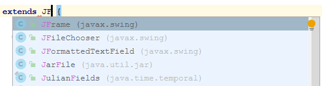
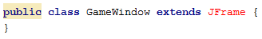
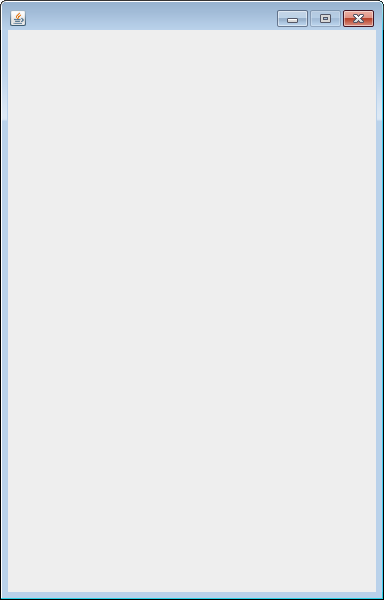
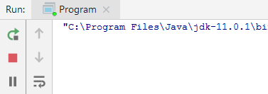
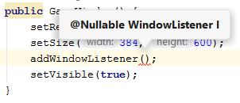
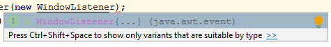
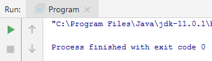
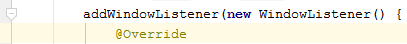
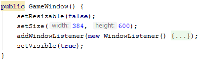

## TechKids - Code Intensive - Hướng dẫn thực hành
### Chuẩn bị cửa sổ game

1. Tạo file `GameWindow.java` trong folder 'src'

2. Biến GameWindow thành `JFrame`

Class `JFrame` của `Swing` sẽ được sử dụng để tạo ra cửa sổ. Chú ý rằng, vì `Swing` chỉ được dùng để thực hiện các phần cơ bản, làm một lần, không phải là trọng tâm của môn học nên sẽ chỉ được nói đến ở mức hết sức cơ bản.

Làm như sau:
Trong file `Gamewindow.java`, để tạo ra một cửa sổ để hiển thị game, <b>đằng sau</b> tên class GameWindow, viết thêm đoạn `extends JFrame`

<pre>
public class GameWindow <b>extends JFrame</b> {
}
</pre>

Làm như trên sẽ biến GameWindow thành một `JFrame`, sẽ thừa hưởng đầy đủ đặc tính mà một cửa sổ (window) cần có

3. Khởi tạo một `GameWindow`, tên là 'gw' trong hàm `main`. Ở đây, hãy tạm thừa nhận các từ khóa như `new` hay hàm `GameWindow()`, những khái niệm này cũng sẽ được trình bày sau
<pre>
public class Program {
  public static void main(String[] args) {
    <b>GameWindow gw = new GameWindow();</b>
  }
}
</pre>

4. Chạy chương trình

5. Mặc dù đã có một GameWindow là `gw`, nhưng sau khi chạy, sẽ thấy <b>kết quả là không có bất kỳ cửa sổ nào được hiện ra</b>. Lý do cho việc này là khi được tạo ra, các `JFrame` hay cụ thể trong trường hợp này là cửa sổ game không được mặc định là sẽ hữu hình - invisible hay `visible=false`

6. Để sửa việc này, vào file `GameWindow.java`, trong class `GameWindow`, thêm hàm `GameWindow()` như sau:
<pre>
public class GameWindow extends JFrame {
  <b>public GameWindow() {
    
  }</b>
}
</pre>

<i>Chú ý: Hàm được thêm vào bắt đầu bằng `public`, vì có tên trùng với tên của class chứa nó - `GameWindow` nên được gọi là hàm tạo - (constructor), cũng sẽ được trình bày vào các bài sau.</i>

7. Trong hàm `GameWindow()`, viết thêm đoạn sau để `GameWindow` được hiện hình
<pre>
public class GameWindow extends JFrame {
  public GameWindow() {
    <b>setVisible(true);</b>
  }
}
</pre>

8. Chú ý: Khi thêm JFrame, hãy tận dụng chức năng autocomplete của IntelliJ, cụ thể khi gõ gần đủ chữ `JFrame`, Intellij sẽ đưa ra các gợi ý để viết nốt class này

Chọn JFrame rồi nhấn `ENTER` để IntelliJ tự viết nốt tên class này và import thư viện cần thiết là `swing` vào file

<pre>
<b>import javax.swing.*;</b>

public class GameWindow extends <b>JFrame</b> {
}
</pre>

Nếu không kịp dùng chức năng trên, có thể phát sinh lỗi java không hiểu JFrame là gì, hiện lên màu đỏ, như sau

Để khắc phục lỗi này, hoặc có thể click vào phần bị lỗi là `JFrame`, rồi gõ `Alt+TAB` để Intellij tự tìm cách import thư viện còn thiếu vào.

Tất nhiên, vẫn có thể thực hiện cách trực tiếp nhất là gõ thêm `import javax.swing.*;` vào những dòng đầu tiên của `GameWindow.java`

9. Chạy chương trình

10. Sẽ có một cửa sổ, mặc dù bé, nhưng đã hiện ra ở <b>góc trên bên trái màn hình</b>

11. Luôn nhớ rằng, trong tương lai, hàm `setVisible(true)` sẽ là hàm được gọi sau cùng, sau tất cả các thao tác, đặc biệt là các thao tác chỉnh cấu hình như kích thước, màu sắc, trong `GameWindow`. Ý tưởng của việc này là `GameWindow` cần được thao tác cấu hình tất cả mọi thứ trước khi được hiện ra

12. Điều chỉnh kích thước của `GameWindow` thành `800x600` ngay sau khi tạo ra bằng cách thêm đoạn sau vào trước `setVisible(true)`
<pre>
public class GameWindow extends JFrame {
  public GameWindow() {
      <b>setSize(800, 600);</b>
      setVisible(true);
  }
}
</pre>

13. Khi chạy lại chương trình, sẽ thấy `GameWindow` - `gw` được hiện lên với kích thước như kỳ vọng

14. Để cố định kích thước của `GameWindow`, thực hiện việc khóa thay đổi kích thước từ phía người dùng bằng cách thêm đoạn lệnh sau vào hàm `GameWindow`
<pre>
public GameWindow() {
    <b>setResizable(false);</b>
    setSize(800, 600);
    setVisible(true);
}
</pre>

15. Chạy chương trình

16. `GameWindow` - `gw` sẽ hiện ra với nút phóng to (maximize) được khóa lại

17. Thử click vào nút  ở góc của cửa sổ game, sẽ thấy mặc dù cửa sổ này được tắt đi, tuy nhiên nếu nhìn kỹ vào trong cửa sổ Run của IntelliJ sẽ thấy chương trình vẫn chưa tắt hẳn

18. Để thực hiện việc thoát chương trình mỗi khi nút  được click, cần làm một việc là biết được khi nào người dùng click vào nút này mà thực hiện việc tắt toàn bộ chương trình theo. Việc biết được chính xác khi nào một sự việc xảy ra (ví dụ người dùng click vào nút ) gọi là <b>bắt sự kiện (catch or listen to events)</b>

19. Để bắt sự kiện click vào nút , trong hàm `GameWindow()`, thêm đoạn sau vào trước `setVisible(true)`
<pre>
public GameWindow() {
    setResizable(false);
    setSize(800, 600);
    <b>addWindowListener();</b>
    setVisible(true);
}
</pre>

20. Có thể thấy hàm `addWindowListener()` đang yêu cầu một tham số có kiểu `WindowListener`

21. Ý tưởng của phần listener (lắng nghe) này sẽ thư viện, hay hệ thống sẽ cho người lập trình biết chính xác khi nào sự kiện xảy ra, bằng các hàm như `addWindowListener()` tuy nhiên thường không biết người lập trình  thao tác xử lý gì khi các sự kiện này xảy ra, nên sẽ yêu cầu các Thao xử lý này khi bắt sự kiện, trong trường này chính là một `WindowListener`

22. Để cung cấp `WindowListener`, thêm `new WindowListener` vào trong cặp ngoặc tròn
<pre>
public GameWindow() {
    setResizable(false);
    setSize(800, 600);
    addWindowListener(<b>new WindowListener</b>);
    setVisible(true);
}
</pre>

Chú ý: Cách khai báo trực tiếp `WindowListener` như trên được gọi là khai báo `inline`, ngoài cách này, còn có thể thực hiện khai báo tại một `class` riêng rồi khởi tạo ở trong cặp ngoặc tròn, sẽ được trình bày sau

23. Khi `new WindowListener` được thêm vào cặp ngoặc tròn, IntelliJ sẽ đưa ra gợi ý để thực hiện nốt phần code này

24. Nhấn `ENTER` để các phần code còn lại được thêm vào

<pre>
addWindowListener(new WindowListener() {
    <b>@Override
    public void windowOpened(WindowEvent e) {
        
    }

    @Override
    public void windowClosing(WindowEvent e) {

    }

    @Override
    public void windowClosed(WindowEvent e) {

    }

    @Override
    public void windowIconified(WindowEvent e) {

    }

    @Override
    public void windowDeiconified(WindowEvent e) {

    }

    @Override
    public void windowActivated(WindowEvent e) {

    }

    @Override
    public void windowDeactivated(WindowEvent e) {

    }</b>
  });
</pre>

25. Ở đây có thể thấy một `WindowListener` được tạo ra với tất cả <b>7</b> hàm được thêm vào, các hàm này sẽ tương ứng với 7 loại sự kiện xảy ra của window. Tuy số hàm có vẻ nhiều nhưng trên thực tế chỉ hai hàm được quan tâm trong bài này

26. Với yêu cầu bắt được sự kiện người dùng click vào nút close , hai hàm tên `windowClosing` và `windowClosed` sẽ là hai hàm cần quan tâm

27. Với sự kiện đóng cửa sổ game, chỉ có một hàm trong hai hàm này sẽ được gọi, để biết được chính xác đó làm hàm nào, thực hiện in ra tên hàm ở trong chính thân hai hàm này

<pre>
@Override
public void windowClosing(WindowEvent e) {
    <b>System.out.println("windowClosing");</b>
}

@Override
public void windowClosed(WindowEvent e) {
    <b>System.out.println("windowClosed");</b>
}
</pre>

28. Chạy chương trình và click vào nút  của cửa sổ game, sẽ thấy chỉ có `"windowClosing"` được in ra, hay nói cách khác chỉ có hàm `windowClosing()` được gọi. Như vậy `windowClosing()` chính là hàm cần để xử lý

29. Sau khi bắt được chính xác khi nào sự kiện cần quan tâm xảy ra, cần thực hiện xử lý sự kiện này, cụ thể là thực hiện việc thoát chương trình, bằng cách thêm đoạn code sau vào trong hàm `windowClosing()` thay cho lệnh `println`

<pre>
public void windowClosing(WindowEvent e) {
    <b>System.exit(0);</b>
}
</pre>

Chú ý: `System.exit()` là hàm thực hiện việc thoát toàn bộ chương trình, hàm này yêu cầu một tham số truyền vào tên là status, kiểu int, để biểu hiện lý do thoát chương trình, với `status=0` biểu hiện chương trình được thoát và không có lỗi xảy ra trước đó

30. Chạy thử chương trình, khi cửa sổ game hiện lên, bấm vào nút , sẽ thấy chương trình được thoát hẳn

31. Để cho gọn code, click vào nút  ở đầu dòng `addWindowListener` để thu nhỏ lại toàn bộ phần code này

sẽ được như sau

*Phần kế tiếp [Chuẩn bị Game Canvas](setup_game_canvas.md)*