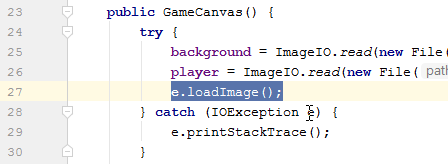

## TechKids - Code Intensive - Hướng dẫn thực hành
### Sử dụng class để đóng gói các đối tượng game

1. Việc tổ chức chương trình như hiện tại, có những vấn đề sau

* Tất cả chức năng game được viết cả vào `GameCanvas.java`, trong tương lai, càng thêm nhiều chức năng cho game, `GameCanvas.java` sẽ càng trở nên khó kiểm soát
* Các phần code thao tác xử lý và các thuộc tính của từng đối tượng game đang được để chung với nhau, khi càng nhiều đối tượng được thêm vào, việc phân biệt phần code xử lý và thuộc tính nào thuộc về đối tượng nào càng trở trên dễ nhầm lẫn

2. Để giải quyết các khó khăn trên, cần tổ chức lại chương trình theo cách khác

3. Cụ thể, cần phải tách các chức năng của `GameCanvas.java` ra thành các file khác nhau, VÀ các phần code thao tác xử lý và các thuộc tính của cùng một đối tượng cần được sắp xếp ở cùng một file.

4. Ý tưởng gom các thuộc tính (đặc điểm) và các thao tác xử lý các đối tượng (hành động) vào chung một gói (package) chính là một trong những ý tưởng của lâp trình hướng đối tượng (Object Oriented Programming - OOP)

5. Để bắt đầu, áp dụng OOP với quân địch - gom các thuộc tính và hành động của quân địch lại thành một gói

6. Tạo file class `Enemy.java`


7. Trong file `Enemy.java` IntelliJ đã tạo sẵn class `Enemy`

```
public class Enemy {
}
```

8. Quay lại file `GameCanvas.java`, chọn ra các thuộc tính và thao tác xử lý liên quan đến quân địch

9.Các thuộc tính và thao tác này được liệt kê và phân loại như sau:

* Các thuộc tính, dữ liệu

<pre><b>
int enemyX = 100; // Tọa độ x
int enemyY = 0; // Tọa độ y
BufferedImage enemy; // Ảnh quân địch
</b>
</pre>

* Các thao tác xử lý
<pre>
public GameCanvas() {
    try {
        ...
        <b>enemy = ImageIO.read(new File("assets/images/enemies/level0/blue/0.png")); // Load ảnh </b>
    } catch (IOException e) {
        e.printStackTrace();
    }
}
</pre>

<pre><b>
void updateEnemyPosition() {
    enemyY += 1; // Cập nhật tọa độ  ~ di chuyển 
}
</b>

@Override
protected void paintComponent(Graphics g) {
    ...
    <b>g.drawImage(enemy, enemyX, enemyY, null); // Vẽ ảnh quân địch </b>
}
</pre>

10. Các phần dữ liệu sẽ được chuyển thành thuộc tính của class `Enemy`. Các thao tác xử lý sẽ được chuyển thành hàm, hay còn gọi là phương thức của class `Enemy`

11. Mở file `Enemy.java`

12. Trong class `Enemy`, khai báo các thuộc tính `int x`, `int y`, `BufferedImage image`, các thuộc tính này sẽ để thay thế cho lần lượt `int enemyX`, `int enemyY` và `BufferedImage enemy`

<pre>
<b>import java.awt.image.BufferedImage;</b>

public class Enemy {
    <b>int x;
    int y;
    BufferedImage image;</b>
}
</pre>

Chú ý: Vì các dữ liệu này được khai báo trong class `Enemy`, thuộc về `Enemy`, nên tên của chúng không cần phải chứa phần `enemy` như khi ở `GameCanvas`

13. Khai báo và thực hiện các thao tác xử lý tương ứng với các thao tác đã có ở class `GameCanvas`

<pre>
...
<b>import javax.imageio.ImageIO;
import java.io.File;
import java.io.IOException;</b>

public class Enemy {
    ...
    <b>void loadImage() {
        try {
            image = ImageIO.read(new File("assets/images/enemies/level0/blue/0.png"));  // Load ảnh
        } catch (IOException e) {
            e.printStackTrace();
        }
    }
    
    void updatePosition() {
        y += 1; // Cập nhật tọa độ ~ di chuyển
    }
    
    void paint() {
        g.drawImage(x, y, image, null); // Vẽ ảnh quân địch
    }
    </b>
}

</pre>

14. Có thể thấy ở hàm `paint()`, `g`, kiểu `Graphics` dùng để hiển thị ảnh không tồn tại


15. `Graphics g` được sở hữu bởi `GameCanvas.java`, cụ thể là tham số đầu vào của hàm `paintComponent()`.

<pre>
@Override
protected void paintComponent(<b>Graphics g</b>) {
    ...
}
</pre>

16. Để `Enemy` có được `Graphics g` để thao tác, cần điều chỉnh lại hàm `paint` của class này để hàm này nhận được `Graphics g` từ `GameCanvas`

<pre>
void paint(Graphics g) {
    g.drawImage(x, y, image, null); // Vẽ ảnh quân địch
}
</pre>

17. Cập nhật lại `GameCanvas`, thay thế tất cả các thuộc tính và thao tác xử lý rời rạc bằng một `Enemy e`;

18. Xóa đi các thuộc tính của `GameCanvas`

<pre>
public class GameCanvas extends JPanel {
    BufferedImage background;
    BufferedImage player;
    <s>BufferedImage enemy;<//s>
    int playerX = 176;
    int playerY = 500;
    <s>int enemyX = 100;</s>
    <s>int enemyY = 0;</s>
    ...
}
</pre>

19. Sau khi xóa các phần trên đi, `IntelliJ` sẽ báo lỗi các phần code thao tác liên quan do các định nghĩa này đã không còn tồn tại


20. Các phần xử lý rời rác này sẽ được thay bằng một `Enemy e` duy nhất

21. Khai báo `Enemy e`

<pre>
public class GameCanvas extends JPanel {
    BufferedImage background;
    BufferedImage player;
    int playerX = 176;
    int playerY = 500;

    <b>Enemy e;</b>
    ...
}
</pre>

22. Thay thao tác load ảnh

<pre>
try {
    ...
    <s>enemy = ImageIO.read(new File("assets/images/enemies/level0/blue/0.png"));</s>
    <b>e.loadImage();</b>
} catch (IOException e) {
    e.printStackTrace();
}
</pre>

23. Thay thao tác vẽ (hiển thị) quân địch

<pre>
@Override
protected void paintComponent(Graphics g) {
    ...
    <s>g.drawImage(enemy, enemyX, enemyY, null);</s>
    <b>e.paint(g);</b> // Truyền vào tham số Graphics g cho e.paint()

</pre>

24. Thay thao tác di chuyển

<pre>
void updateEnemyPosition() {
    <s>enemyY += 1;</s>
    <b>e.updatePosition();</b>
}
</pre>

25. Các thao tác đã được thay xong, chạy chương trình

26. Khi chạy lại chương trình, sẽ nhận được một lỗi như sau


Chú ý: Phần dưới đây ngoài việc sửa lỗi trên còn hướng dẫn cách tìm ra lỗi dựa vào thông tin lỗi nhận được, hãy kiên nhẫn đọc

27. Nhìn vào báo lỗi (stack trace) và loại lỗi


28. Từ loại lỗi, có thể kết luận ở đâu đó trong chương trình của 

<pre>
at GameCanvas.<init>(GameCanvas.java:27)
at GameWindow.<init>(GameWindow.java:46)
<b>at Program.main(Program.java:3)</b>
</pre>

28. Có thể thấy chương trình đang chạy `Program.java` thì lỗi, click vào dòng này để di chuyển thẳng đến vị trí gây lỗi, thường rất ít khi lỗi xảy ra ở vế trái của dấu bằng, quan sát vế phải thì thấy được đây là hàm tạo GameWindow(): `new GameWindow()`, tại điểm này, nếu không lỗi cú pháp thì đây không phải là chỗ trực tiếp xảy ra lỗi. Click để đi tiếp đến đoạn tiếp theo là `GameWindow.java`

<pre>
at GameCanvas.<init>(GameCanvas.java:27)
<b>at GameWindow.<init>(GameWindow.java:46)</b>
at Program.main(Program.java:3)
</pre>


29. Tương tự như `Program.java`, dòng này của `GameWindow.java` không phải là dòng xảy ra lỗi trực tiếp, di chuyển đến vị trí tiếp theo ở trong file `GameCanvas.java`

<pre>
<b>at GameCanvas.<init>(GameCanvas.java:27)</b>
at GameWindow.<init>(GameWindow.java:46)
at Program.main(Program.java:3)
</pre>



30. Ở đây, hàm `loadImage()` được gọi với object `e` và không phải là hàm tạo (`new`), rất có thể ở tại thời điểm này, `e` chưa được khởi tạo, có thể kiểm tra nhanh bằng cách log ở trước dòng này

<pre>
        ...
        System.out.println(e);
        <b>e.loadImage();</b>
        ...
</pre>

31. Klết quả nhận được là ngoài lỗi, trước đó việc log `e` ra cho kết quả `null`, đây chính là điểm gây lỗi


32. Nguyên nhân của việc `e` bằng `null` là do object này chưa được khởi tạo

Chú ý: Với một đối tượng, khi khai báo mà không khởi tạo, đối tượng này sẽ tự động (by default) có giá trị là `null`, nghĩa là

`Enemy e;`

sẽ giống với

`Enemy e = null;`

33. Để chữa lỗi, việc cần làm là khởi tạo e

<pre>
    public GameCanvas() {
        <b>e = new Enemy();</b>
        ...
</pre>

34. Chạy chương trình


35. Việc chuyển enemy sang thành 1 class đã hoàn tất