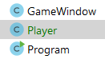

## TechKids - Code Intensive - Hướng dẫn thực hành
### Sử dụng class để đóng gói player

1. Để thực hiện việc refactor các chức năng của player thành 1 class riêng, việc đầu tiên cần làm là khoang vùng cách phần code thuộc về tính năng của player.

Hiện tại tất cả các chức năng của player đang nằm ở `GameCanvas.java`, trong file này, cụ thể phân tích như sau

- Khoanh vùng các đoạn code thực thi sẽ được chuyển thành methods của player

__Chức năng load ảnh__
<pre>
public GameCanvas() {
  ...
  try {
      background = ImageIO.read(new File("assets/images/background/0.png"));
      <b>player = ImageIO.read(new File("assets/images/players/straight/0.png"));</b>
      e.loadImage();
  } catch (IOException e) {
      e.printStackTrace();
  }
  ...
}
</pre>

__Chức năng hiển thị, hay vẽ hình__
<pre>
@Override
protected void paintComponent(Graphics g) {
  ...
  g.drawImage(background, 0, 0, null);
  <b>g.drawImage(player, playerX, playerY, null);</b>
  ...
}
</pre>

__Chức năng di chuyển__
<pre>
void updatePlayerPosition() {
  <b>if (leftPressed) {
    playerX -= 5;
  }
  if (rightPressed) {
    playerX += 5;
  }
  if (upPressed) {
    playerY -= 5;
  }
  if (downPressed) {
    playerY += 5;
  }</b>
}

</pre>

- Khoanh vùng các properties thuộc về Player:

<pre>
BufferedImage background;

<b>BufferedImage player;
int playerX = 176;
int playerY = 500;</b>

...

boolean leftPressed;
boolean rightPressed;
boolean upPressed;
boolean downPressed;
</pre>

Có thể thấy ngay hỉnh ảnh (`player`) và vị trí (`playerX`, `playerY`) đương nhiên thuộc về Player

Còn một điểm gây tranh cãi, đấy là các trạng thái phím bấm

<pre>
boolean leftPressed;
boolean rightPressed;
boolean upPressed;
boolean downPressed;
</pre>

có thuộc về player hay không?

Câu trả lời là _tùy tình huống_. Cụ thể, nếu như trong cả game, chỉ có khi làm việc với player, các phím bấm được sử dụng thì trạng thái các phím này thuộc về player, tuy nhiên nếu như tại một thời điểm nào đó, các phím bấm này còn được dùng cho các mục đích khác, ví dụ di chuyển lên xuống trong menu, thì nó không thể chỉ thuộc về mỗi Player được mà cần được tách riêng ra.

Ở thời điểm hiện tại, cả 2 cách đều được chấp nhận, còn cụ thể trong nội dung này, lựa chọn sau - tức các trạng thái trên không thuộc player, sẽ được thực hiện. Mặc dù các trạng thái này được tính là không thuộc về player nhưng lại liên quan trực tiếp với việc thay đổi tọa độ `playerX` và `playerY`, nên sẽ được sử dụng bởi player dưới dạng tham số đầu vào, sẽ được trình bày ở phần tiếp theo.

2. Bắt tay vào thực hiện, đầu tiên tạo file `Player.java`

3. Trong file `Player.java`, khai báo các methods tương ứng với các chức năng đã phân tích

<pre>

<b>import java.awt.*;</b>

public class Player {
  <b>void loadImage() {
      
  }

  void paint(Graphics g) {
      
  }
  
  void move(boolean leftPressed, boolean rightPressed, boolean upPressed, boolean downPressed) {
      
  }</b>
}

</pre>

4. Khai báo các properties cần có để thực hiện các methods hay chức năng trên

<pre>
import java.awt.*;
<b>import java.awt.image.BufferedImage;</b>

public class Player {
  <b>int x = 176;
  int y = 500;
  BufferedImage image;</b>

  void loadImage() {
      
  }

  void paint(Graphics g) {
      
  }
  
  void move(boolean leftPressed, boolean rightPressed, boolean upPressed, boolean downPressed) {
      
  }
}

</pre>

5. Lần lượt thực hiện các chức năng

__Chức năng load ảnh__
<pre>
<b>import javax.imageio.ImageIO;</b>
import java.awt.*;
import java.awt.image.BufferedImage;
<b>import java.io.File;
import java.io.IOException;</b>

public class Player {
  int x = 176;
  int y = 500;
  BufferedImage image;

  void loadImage() {
      <b>try {
          image = ImageIO.read(new File("assets/images/players/straight/0.png"));
      } catch (IOException e) {
          e.printStackTrace();
      }</b>
  }
  ...
}
</pre>

__Chức năng hiển thị hay vẽ ảnh__
<pre>
public class Player {
  ...
  void paint(Graphics g) {
    <b>g.drawImage(image, x, y, null);</b>
  }
  ...
}
</pre>

__Chức năng di chuyển__
<pre>
public class Player {
  ...
  void move(boolean leftPressed, boolean rightPressed, boolean upPressed, boolean downPressed) {
    <b>if (leftPressed) {
      x -= 5;
    }
    if (rightPressed) {
      x += 5;
    }
    if (upPressed) {
      y -= 5;
    }
    if (downPressed) {
      y += 5;
    }</b>
  }
  ...
}
</pre>

6. Đưa class `Player` vào sử dụng, thay thế cho phần code cũ ở trong `GameCanvas.java`, xóa đi các thuộc tính cũ liên quan đến player và thay thế bằng một biến kiểu `Player`, `p`

<pre>
public class GameCanvas extends JPanel {
  BufferedImage background;
  <s>BufferedImage player;</s>
  <s>int playerX = 176;</s>
  <s>int playerY = 500;</s>
  <b>Player p;</b>
  Enemy e;

  boolean leftPressed;
  boolean rightPressed;
  boolean upPressed;
  boolean downPressed;
</pre>

Các lỗi xảy ra sau thao tác này chính là các chức năng cũ của player cần được thay bằng việc sử dụng `Player p`. Việc này sẽ được thực hiện, tuy nhiên, cần phải xếp sau việc khởi tạo `Player p`

<pre>
public GameCanvas() {
  e = new Enemy();
  <b>p = new Player();</b>
  ...
}
</pre>

7. Dùng các chức năng của `Player p` để thay thế cho các chức năng cũ

__Load ảnh__
<pre>
public GameCanvas() {
  e = new Enemy();
  p = new Player();
  try {
    background = ImageIO.read(new File("assets/images/background/0.png"));
    <s>player = ImageIO.read(new File("assets/images/players/straight/0.png"));</s>
    <b>p.loadImage();</b>
    e.loadImage();
  }
  ...
}
</pre>

__Hiển thị hay vẽ ảnh__
<pre>
@Override
protected void paintComponent(Graphics g) {
  ...
  <s>g.drawImage(player, playerX, playerY, null);</s>
  <b>p.paint(g);</b>
  ...
}
</pre>

__Di chuyển__
<pre>
void updatePlayerPosition() {
  <b>if (leftPressed) {
    playerX -= 5;
  }
  if (rightPressed) {
    playerX += 5;
  }
  if (upPressed) {
    playerY -= 5;
  }
  if (downPressed) {
    playerY += 5;
  }</b>
  
}
</pre>